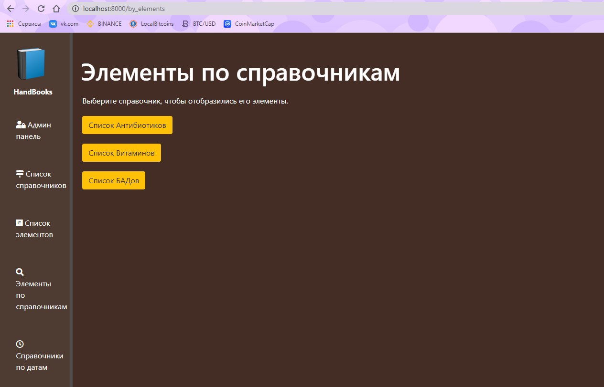

# Тестовое задание в компанию KOMTEK

## Описание

- Веб фреймворк Django
- База данных SQLite
- Python 3.8.6

### Login/Password

Логин: admin
Пароль: komtek

### Описание проекта и примеры

В ходе работы над проектом было реализовано две сущности(модели): "Справочник" и "Элемент справочника".
Сайт имеет простой html/css дизайн.

На главной странице отображаются все созданные справочники (по 2 справочника), реализован постраничный вывод результата.

На странице "Список элементов" отображаются все созданные элементы (по 3 элемента), реализован постраничный вывод результата.

На странице "Элементы по справочникам" отображаются все созданные справочники в виде кнопок, по нажатию на которые открываются страницы с принадлежащими справочнику элементами(по 10 элементов), реализован постраничный вывод результата.

##### Админ панель

В панеле администратора реализованы следующие возможности:

- Создание новых справочников с указанием всех атрибутов
- Создание элементов с указанием к какому справочнику они принадлежат
- Редактирование моделей, удаление и поиск
- Сортировка моделей по различным полям

